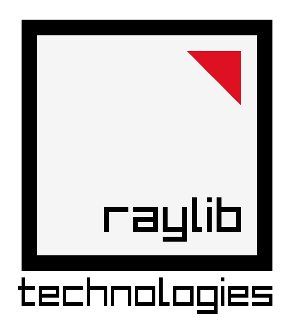

# Team DSG

<h3>
Dimitar Harizanov - Scrum Trainer
</h3>
<h3>
Mark Dimitrov - Back-end Developer
</h3>
<h3>
Presiyan Tanchev - Designer
</h3>
<h3>
Kristiyan Parashkevov - Front-end Developer
</h3>

# About Parolino
<h3>
 Our game Parolino is about password guessing. For this project we used C++ as a programming language.
</h3>    

# 📄 Documentation
<h3> <a href="https://github.com/codingburgas/sprint-math-games-9th-grade-dsg/Documentation/Parolino.pptx">Presentation</h3>
<h3><a href="https://github.com/codingburgas/sprint-math-games-9th-grade-dsg/Documentation/DSG-documentation.docx">Documetion</a></h3>

<h1> Used Technologies</h1>
<h3> Used code editor & collaborative services:</h3> 

  
  
  
  
  

<h3>Used technologies for our project development:</h3> 

  
  

<h2>Made by DSG</h2>